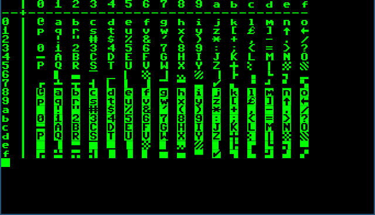
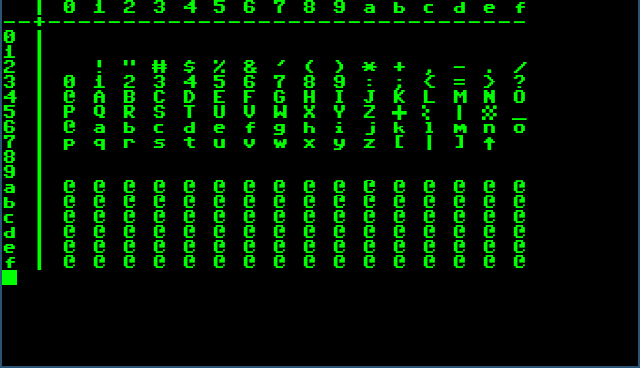

Configuration
=============

RetroFont uses a configuration file for:

- Specifying the base font.
- Glyph mirroring.
- Character set mapping.
- Primary font mapping.

The package includes a configuration file, the location of which is shown by
the following command.

::

    retrofont show_config

To modify the configuration, a copy can be placed in the user's home
directory.

.. code:: text

    mkdir -p ~/.config/retrofont/
    cp $(retrofont show_config) ~/.config/retrofont/config.yaml

This new configuration file will now be used instead of the one provided in
the package.

Base font
---------

.. code:: yaml

    font:
      base: /usr/share/fonts/truetype/dejavu/DejaVuSansMono.ttf

To change the base font, the ``base`` variable in the ``font`` section should
be set to the file name of a TrueType font. Make sure this is a monospaced
font.

.. _config_system:

Systems
-------

System configurations reside in the ``systems`` section. A system
configuration must contain one mandatory key ``name``, which value must be a
unique identifier. All other keys are optional.

The ``mirror`` key, when set to ``true`` will instruct RetroFont to mirror all
glyphs in the vertical axis. 

The ``map_offset`` key, when defined will instruct RetroFont to extract a
permutation table from a binary file, usually a firmware ROM image. The value
of this key must be set to the offset of a 256 byte table in the provided
file, which on the command line must be given via the ``-f`` option.

Under the ``primary`` key, optional ``character_blocks`` and ``characters``
keys are found. A character block consists of two elements: a destination and
a source range. A character only contains a destination and a source.

.. code:: yaml

    systems:
      # ...
      - name: C64
        primary:
          character_blocks:
            - [0x20, [0x20, 0x60]]
            - [0x60, [0x00, 0x20]]
          characters: [
            [0x40, 0x00], [0x5f, 0x64], [0x7c, 0x5d]]
      # ...

In the following figures, we see how the ROM font is mapped to the primary
font.

    Commodore 64 ROM font.

    Primary font using the Commodore 64 character set.

In this instance, characters from 0x20 to 0x5f are mapped to position 0x20
onward in the primary character set. Likewise characters from 0x00 to 0x1f are
mapped to position 0x60 onward. Additionally, character 0x00 (``@``) is mapped
to position 0x40, character 0x64 (``_``) to position 0x5f and character 0x5d
(``|``) to position 0x7c.

Contributing
------------

New system configurations and additions to existing system configurations are
welcome_.

.. _welcome: https://github.com/jfjlaros/retrofont/blob/master/.github/CONTRIBUTING.md
