Gallery
=======

Atari
-----

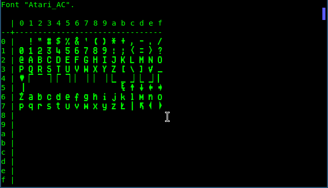

    "Atari_AC" used as additional font.

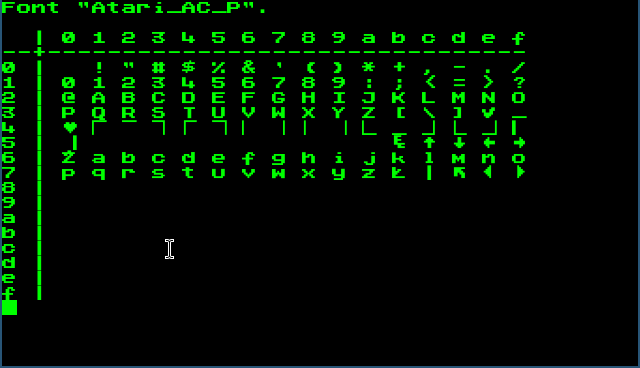

    "Atari_AC" used as primary font.

BBC Micro
---------

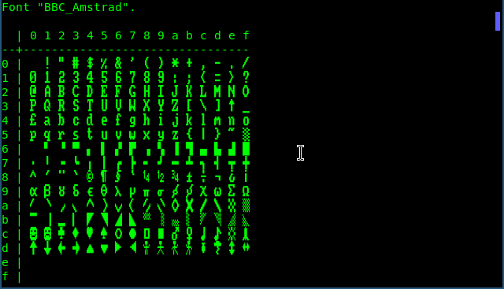

    "BBC_Amstrad" used as additional font.

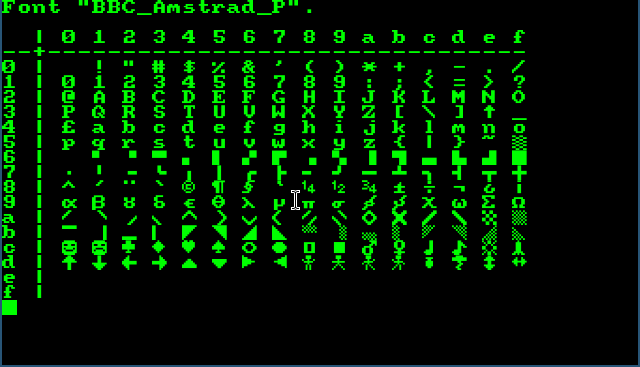

    "BBC_Amstrad" used as primary font.

Commodore 64
------------

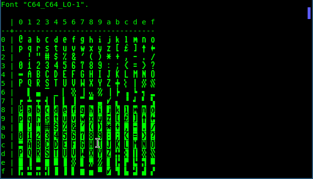

    "C64_C64_LO-1" used as additional font.

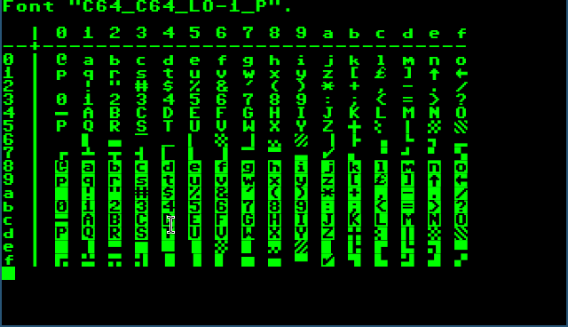

    "C64_C64_LO-1" used as primary font.

Amstrad CPC
-----------

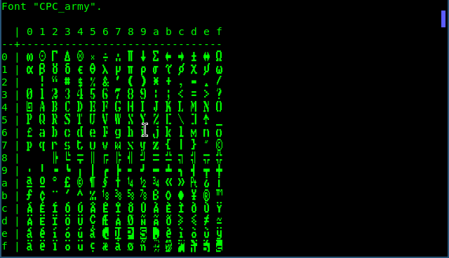

    "CPC_army" used as additional font.

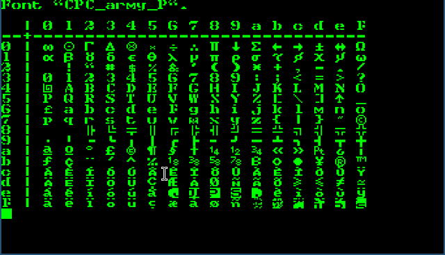

    "CPC_army" used as primary font.

MSX
---

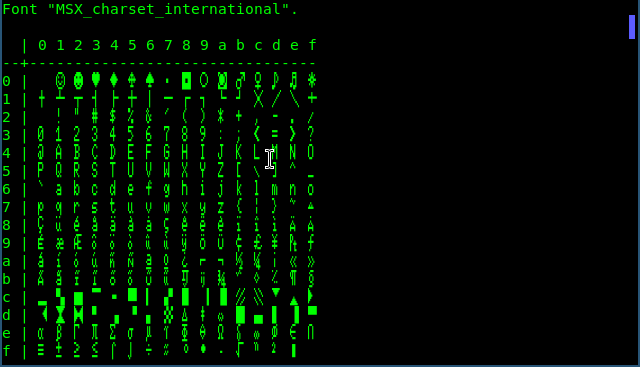

    "MSX_charset_international" used as additional font.

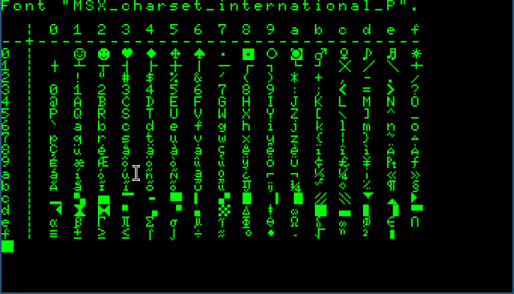

    "MSX_charset_international" used as primary font.

Oric
----

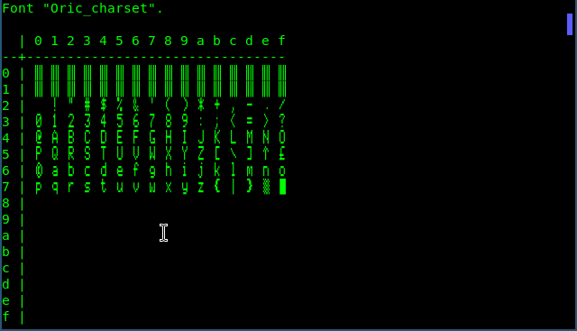

    "Oric-charset" used as additional font.

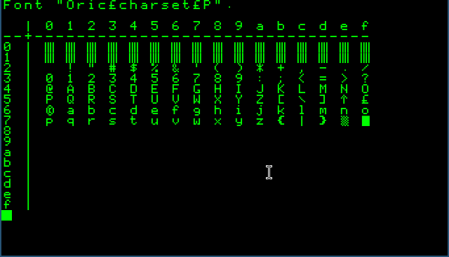

    "Oric-charset" used as primary font.

PC
--

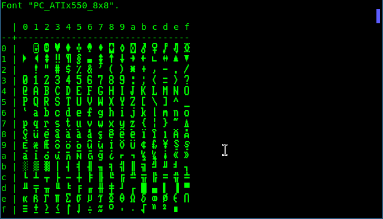

    "PC_ATIx550_8x8" used as additional font.

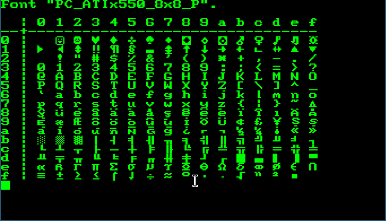

    "PC_ATIx550_8x8" used as primary font.

ZX Spectrum
-----------

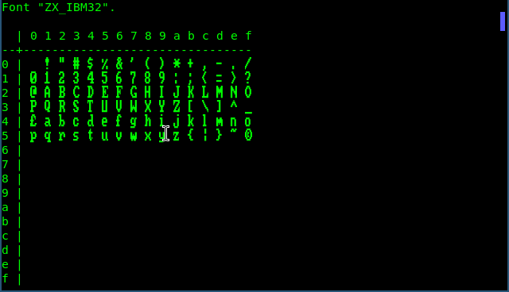

    "ZX_IBM32" used as additional font.

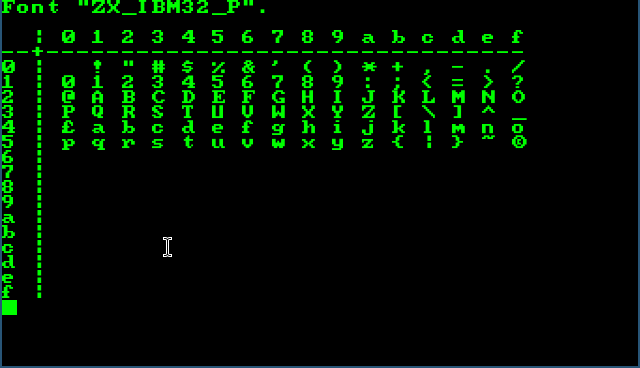

    "ZX_IBM32" used as primary font.
