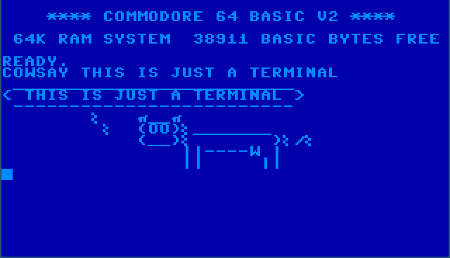
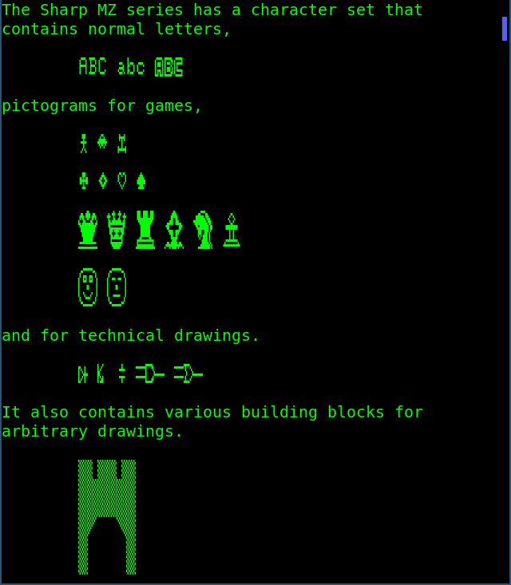
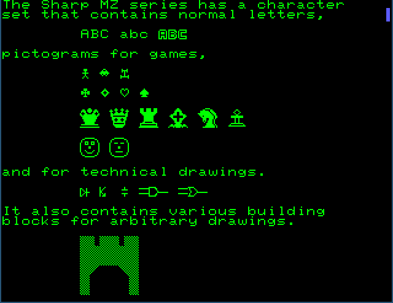
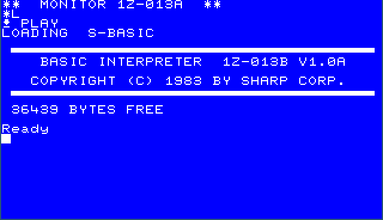
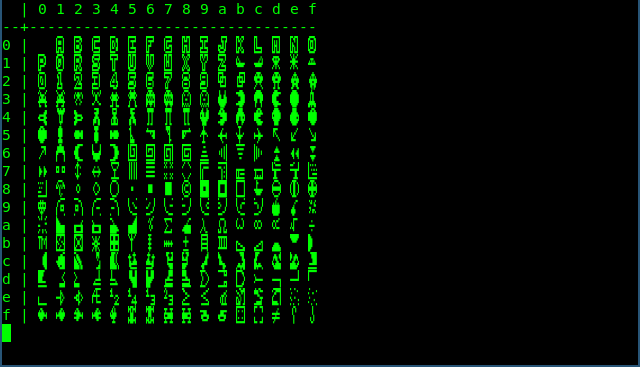
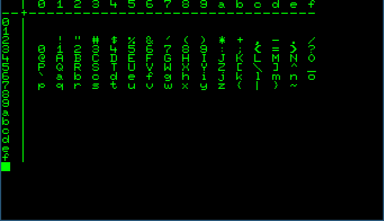

Usage
=====

This package provides a command line interface for conversion, creation and showing TrueType retro fonts. It does so by converting binary encoded glyphs form character ROM images or by converting to and from a human readable format.

    Plain Bash running in a terminal.

``rom2ttf``
-----------

The ``rom2ttf`` subcommand creates a font that contains character sets in the
UTF-8 Private Use Area. The main use case for this subcommand is covered in
the the :ref:`quickstart` section. Here, we will focus on more complicated
cases. The Sharp MZ-700 provides us with such a case, this system has two
character sets, characters are stored in a different order from which they are
used (the firmware uses a mapping table) and all glyphs are mirrored.

Both the character ROM as well as the firmware can be found in the
`internet archive`_.

.. code:: bash

    retrofont rom2ttf -d ~/.local/share/fonts -f 1z-013a.rom -s SharpMZ SharpMZ mz700fon.int
    fc-cache -f

In this example, we provide a system name via the ``-s`` option, which is
used to retrieve system specific configuration values. For the Sharp MZ
series, the ``mirror`` configuration value, which controls the mirroring of
glyphs, is set to ``true`` and the ``map_offset`` configuration value is set
to ``0x0a92``. The latter value is used in conjunction with the ``-f`` flag,
which provides a path to the firmware ROM image. A mapping table of 256 bytes
is read from the ROM impage from offset 0x0a92 onward. This mapping table is
used to permute the character sets.

This command converts the character ROM image file ``mz700fon.int`` to a
TrueType font file named ``SharpMZ.ttf`` and placed in
``~/.local/share/fonts`` as provided via the ``-d`` option. The font name is
set to ``SharpMZ``, the last but one parameter controls both the file name as
the font name.

The font can be used in a terminal as follows. In Wayland we can use ``foot``
as follows.

.. code:: text

    foot -f SharpMZ

In X, ``xterm`` can be used.

.. code:: text

    xterm -fa SharpMZ

The character sets are placed in the UTF-8 Private Use Area U+E000. This
allows for mixing bothe the original font as well as the additional fonts. 

    Plain text mixed with SHarp MZ characters.

The ``-p`` flag additionally changes the primary font, uses square characters
and removes line spacing.

.. code:: bash

    retrofont rom2ttf -d ~/.local/share/fonts -f 1z-013a.rom -s SharpMZ -p SharpMZ_P mz700fon.int
    fc-cache -f

In this example, the TrueType font is named ``SharpMZ_P`` and is written to
``SharpMZ_P.ttf``. Analogous to the previous example, this font can be used as
follows.

.. code:: text

    foot -f SharpMZ_P

    Sharp MZ character set in the primary font.

Adjusting the terminal foreground and background colours can have quite a
convincing effect.

    This is not a screenshot of an emulator.

``show``
--------

Since the character ROM contains two character sets and a mapping table is
provided, four character sets will be placed in the UTF-8 Private Use Area.
The two permuted character sets are placed at offsets U+E000 and U+E100
respectively. The two original character sets are placed after the permuted
sets at offsets U+E200 and U+E300 respectively.

The character sets can be shown using the ``show`` subcommand. The fourth
character set (second character set, not permuted) is shown as follows.

.. code:: text

    retrofont show 3

    The second Sharp MZ character set as stored in the character ROM image.

Additionally, the primary character set has index -1. If the ``-p`` option of
the ``rom2ttf`` subcommand was used to create the font, the output should look
as follows.

.. code:: text

    retrofont show -1

    lorem ipsum

``rom2yml``
-----------

A character ROM file can be converted to a human readable YAML file using the
``rom2yml`` subcommand, in which te glyphs can be edited.

.. code:: text

    retrofont rom2yml mz700fon.int mz700fon.yml

The newly created YAML file starts as follows.

.. code:: yaml

    - - data:
        - '  ####  '
        - ' #    # '
        - ' #    # '
        - ' ###### '
        - ' #    # '
        - ' #    # '
        - ' #    # '
        - '        '
        offset: 1
      - data:
        - '  ##### '
        - ' #   #  '
        - ' #   #  '
        - '  ####  '
        - ' #   #  '
        - ' #   #  '
        - '  ##### '
        - '        '
        offset: 2
      # ...

Notice that the glyphs are mirrored, this is one of the reasons we need a
``SharpMZ`` configuration section.

``yml2rom``
-----------

Since YAML files are easy to read and modify, ``rom2yml`` makes it easy to
inspect the content of a character ROM file and to make modifications when
needed.

The subcommand ``yml2rom`` can be used to create a character ROM file from a
YAML file. After which, the ``rom2ttf`` subcommand can be used to create a
TrueType font.

.. _internet archive: https://ia803204.us.archive.org/view_archive.php?archive=/29/items/mame-0.221-roms-merged/mz700.zip
